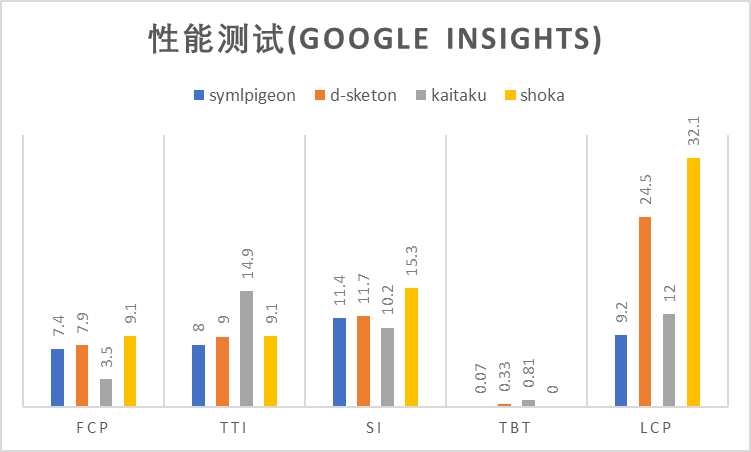

# 性能优化
## 性能报告
:::tip
性能报告的测试网站均为较有特点的Shoka(X)网站 \
报告中的symlpigeon和shoka较有横向对比性(除LCP)
:::

## 优化网页
:::tip
下方数据均基于google pagespeed移动设备规格测试
:::
Shoka系主题的图片都是性能影响的最大因素，可通过如下方法优化:
#### 使用webp或avif等现代图片格式
根据ShokaX开发者测试，对shoka主题图片进行webp转换+等级6压缩，可以在不影响画质(肉眼难以分辨)的情况下，
将大小降低约65%。
这项可以大幅优化FCP(约减少50%)和LCP(约减少40%)并提升初访问体验。
由于ShokaX已不再支持IE11，因此webp的兼容性问题近乎为0

#### 开启`fixedCover`功能
根据社区测试，此选项可以在不进行webp的优化的情况下，将FCP降低17%，LCP降低80%。
此功能会让头图仅显示一张以大幅降低网络负载

#### 减少插件使用
平均每个插件都会让FCP增加0.1-0.3秒并让SI增加0.3-0.8秒，尤其是qweather类插件
会发起大量的HTTP请求并拖慢加载速度。

#### 自编译typescript和调整压缩配置
ShokaX 稳定版提供了预编译的 javascript ES2017 版本，如果你的站点需要 ES6 兼容或希望拥有更高的性能，请参考二次开发或typescript官方文档自编译ts \
ShokaX 默认 terser 使用 ES2018 作为压缩配置，可自行调整

#### 关闭不使用的功能
ShokaX 提供了关闭部分功能的配置，例如`noPlayer`和`disableVL`，这两项都可以提高 js 运行时效率并缩小 js 体积。
`noPlayer`理论上可以减少20%的 js 大小。`disableVL`的性能优化几乎为0，但提高了多标签页下的用户体验
